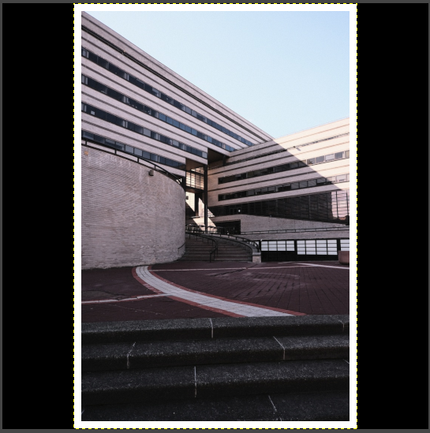
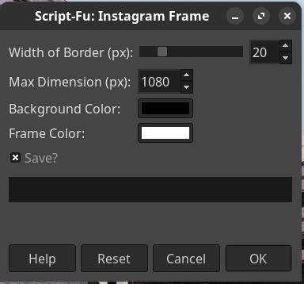

# Gimp Instagram Image Framer
Purpose of this script is to frame images in a border with an alternative color background in a square so
that they display at the correct ratio on social media.  The script frames images and then sizes them to maximize size while maintaining image ratio, it then fills the remaining space with the chosen background color.



## Setup
Gimp needs to be installed.

Copy the scheme (.scm) file from the repo into the gimp script directory, more info here:
<https://docs.gimp.org/en/install-script-fu.html>

You can also symlink the file from this repo to the directory, in Linux/Max eg
```
ln -s ~/Documents/Gimp-IG-Frame/frame.scm ~/.config/GIMP/2.10/scripts/
```

After copying the file to the folder, in Gimp, load the script by going to 
Filters -> Script-Fu -> Refresh Scripts

This only needs to be done once!

The new script should be found under 
Image -> Instagram Frame

## Using the new tool
Make sure a picture is open!

Then select the output image size, the border and background color, and the framing width/height and whether to save it in the same folder as the picture.




Then press Ok! And it will show the new layers in Gimp and also output a file if that option is selected.


## Future Work
- [] Add other aspect ratios
- [] Add message when no images are open after an image is closed indicating there's nothing to process
- [] Add batch processing for a directory


Thats it :) 
